# Kiến Trúc Bidding Và Bid Resolution vBay

Tài liệu này mô tả kiến trúc nghiệp vụ của bidding trong vBay. Khác với các service thiên về CRUD hoặc lifecycle đơn giản, bidding là phần có nhiều nhánh quyết định nhất: nó vừa thay đổi giá auction, vừa thay đổi ví, bid history, auto-bid, payment và realtime event trong cùng một transaction.

## 1. Vì Sao Bidding Có Pipeline Riêng

Các service như `AuthService`, `AuctionService` hoặc `UserAccountService` thường xử lý một nhóm dữ liệu chính: đăng nhập tạo session, tạo auction, tạo deposit request hoặc cập nhật trạng thái user. Bidding phức tạp hơn vì một request có thể kéo theo nhiều thay đổi phụ thuộc lẫn nhau:

- Một manual bid có thể làm người thắng cũ bị outbid, release hold cũ, hold tiền của bidder mới và cập nhật `current_price`.
- Một auto-bid có thể vừa bị reject với requester nhưng vẫn tạo bid phản ứng cho auto-bid đang thắng.
- Buy now phải kết thúc auction, xử lý bid cũ, auto-bid cũ, payment và trạng thái auction.
- Reserve price quyết định bid hiện tại đã đủ điều kiện thắng cuối cùng hay chưa.
- Anti-snipe có thể kéo dài `ending_time`, làm scheduler phải reschedule task kết thúc auction.

Vì vậy bidding được tổ chức thành pipeline nhiều lớp:

- Service chỉ điều phối request, kiểm tra session, validate đầu vào, mở transaction, lock auction bằng `FOR UPDATE` và load dữ liệu cần thiết.
- `AuctionBidEngine` xử lý logic nặng của manual bid, auto-bid, buy now, reserve price và anti-snipe.
- Engine không ghi database trực tiếp mà trả về `BidResolution`.
- `BidResolutionApplier` đọc resolution và thao tác database theo các change đã được engine quyết định.
- Result layer đóng gói dữ liệu sau transaction để service publish domain event và trả response cho client.

```mermaid
flowchart LR
    Service[ManualBidService / AutobidService / BuyNowService]
    Engine[AuctionBidEngine]
    Resolution[BidResolution]
    Applier[BidResolutionApplier]
    Applied[AppliedBidResolution]
    Mapper[AppliedBidResultMapper]
    Result[PlaceBidResult / BuyNowResult / AutobidRegistrationResult]
    Events[Domain Events + Response]

    Service -->|lock + validate + load state| Engine
    Engine -->|build changes| Resolution
    Resolution --> Applier
    Applier -->|apply DB changes + reload state| Applied
    Applied --> Mapper
    Mapper --> Result
    Result --> Events
```



## 2. Service, Engine Và Resolution

`ManualBidService`, `AutobidService` và `BuyNowService` giữ vai trò application service. Chúng chịu trách nhiệm mở transaction, gọi repository để lock auction, kiểm tra trạng thái ban đầu và chọn đúng engine method.

`AuctionBidEngine` là nơi chứa quyết định nghiệp vụ:

- Manual bid thắng hoặc bị auto-bid hiện tại phản ứng.
- Auto-bid mới thắng, thua hoặc làm auto-bid cũ tăng bid phản ứng.
- Buy now kết thúc auction và thắng mọi auto-bid.
- Reserve price có thể làm bid hiện tại chưa đủ điều kiện thắng cuối cùng.
- Anti-snipe có thể tạo `AntiSnipeAuctionExtensionChange` khi bid hợp lệ ở sát giờ kết thúc.

Engine trả về `BidResolution` thay vì tự ghi database. Điều này giúp logic nghiệp vụ có thể đọc như một danh sách quyết định: giữ tiền, release tiền, tạo bid, đổi trạng thái auto-bid, cập nhật auction, tạo payment.

## 3. BidResolution Builder

`BidResolution.Builder` gom các thay đổi theo nhóm:

| Nhóm change | Ý nghĩa |
| :--- | :--- |
| `BalanceChange` | Hold, release hoặc decrease available balance |
| `BidCreate`, `BidStatusUpdate`, `BidFinalization` | Tạo bid mới, đổi trạng thái bid, finalize bid sau buy now |
| `AutobidCreate`, `AutobidStatusChange`, `AutobidMaxBidUpdate` | Tạo auto-bid, đổi trạng thái auto-bid, tăng max |
| `AuctionChange` | Cập nhật trạng thái/current price/winner/ending time của auction |
| `PaymentCreate` | Tạo payment `HELD` cho auction win hoặc buy now |

Resolution có thể là `accepted` hoặc `rejected`. Một request bị reject vẫn có thể có side effect hợp lệ, ví dụ manual bid bị từ chối vì auto-bid đang thắng đã phản ứng và tạo thêm bid tự động. Vì vậy service không nên throw trước khi apply nếu resolution vẫn có thay đổi cần commit.

## 4. BidResolutionApplier

`BidResolutionApplier` không quyết định nghiệp vụ. Nó chỉ áp dụng những gì `BidResolution` mô tả:

1. Apply balance changes.
2. Apply auto-bid changes.
3. Tạo bid và cập nhật trạng thái bid.
4. Apply bid finalization.
5. Apply auction changes.
6. Tạo payment.
7. Reload auction, balance và my-bid items để tạo `AppliedBidResolution`.

Cách tách này làm service và engine dễ đọc hơn: engine tập trung vào "điều gì phải xảy ra", còn applier tập trung vào "ghi điều đó xuống database như thế nào".

## 5. Đa Hình Với AuctionChange

`AuctionChange` là interface cho các thay đổi trên auction:

```java
public interface AuctionChange {
    long getAuctionId();
    long apply(AuctionRepository auctionRepository) throws SQLException;
}
```

Các class implement `AuctionChange` tự quyết định cách update auction:

- `CurrentBidAuctionChange`: cập nhật `current_price` và `winner_user_id`.
- `BuyNowAuctionChange`: hoàn tất auction theo buy now.
- `AntiSnipeAuctionExtensionChange`: cập nhật `ending_time` khi anti-snipe kéo dài phiên.

`BidResolutionApplier` không cần biết từng loại change làm gì. Nó chỉ lặp qua `resolution.getAuctionChanges()` và gọi:

```java
auctionVersion = auctionChange.apply(auctionRepository);
```

Nếu sau này cần thêm một loại thay đổi auction, ví dụ seller đổi thời gian hoặc admin chỉnh trạng thái theo một rule mới, có thể thêm class implement `AuctionChange` mà không phải sửa vòng apply chung.

## 6. Anti-snipe Policy

Anti-snipe là policy chống đặt giá sát giờ kết thúc. Mục tiêu là nếu một bid hợp lệ xuất hiện trong khoảng thời gian cuối của auction, hệ thống kéo dài `ending_time` để các user khác vẫn có cơ hội phản ứng, thay vì auction kết thúc ngay sau một bid vào giây cuối.

Trong code, anti-snipe không nằm trong scheduler. Scheduler chỉ chạy theo thời gian đã được lưu. Quyết định có cần kéo dài auction hay không nằm trong bidding pipeline:

1. `AuctionBidEngine` xác định bid mới có trở thành winning bid hay không.
2. Sau khi có winning bid, engine gọi `AntiSnipePolicy.resolveExtendedEndingTime(auction, bidTime)`.
3. Nếu policy trả về thời gian kết thúc mới, engine thêm `AntiSnipeAuctionExtensionChange` vào `BidResolution`.
4. `BidResolutionApplier` apply change này qua interface `AuctionChange`, giống các thay đổi auction khác.
5. Repository cập nhật `ending_time` và tăng version của auction.

Rule hiện tại của `AntiSnipePolicy`:

- Nếu `auction.anti_snipe_extension_count >= maxExtensions` thì không extend nữa.
- Tính `windowStart = ending_time - window`; nếu `bidTime` trước `windowStart` thì bid chưa nằm trong vùng anti-snipe.
- Tính `extendedEndingTime = bidTime + extension`.
- Chỉ extend nếu `extendedEndingTime` lớn hơn `ending_time` hiện tại.
- Nếu tất cả điều kiện hợp lệ, policy trả về `extendedEndingTime`.

Các thông số policy được cấu hình tập trung ở `AppConfig.DEFAULT_ANTI_SNIPE_SETTINGS`:

| Thông số | Giá trị hiện tại | Ý nghĩa |
| :--- | :--- | :--- |
| `window` | 30 seconds | Khoảng thời gian trước `ending_time` được xem là vùng anti-snipe |
| `extension` | 5 minutes | Thời gian kéo dài thêm, tính từ thời điểm bid |
| `maxExtensions` | 5 | Số lần extend tối đa của một auction |

`AppConfig.AntiSnipeSettings` validate cấu hình trước khi tạo policy: `window` và `extension` phải là duration dương, `maxExtensions` không được âm. Khi khởi tạo app, `AppConfig` gọi `antiSnipeSettings.toPolicy()` để tạo `AntiSnipePolicy`, sau đó inject policy đó vào `AuctionBidEngine`.

Constructor default của `AntiSnipePolicy` chỉ là fallback khi cần tạo policy trực tiếp, ví dụ trong test hoặc code cũ. Runtime chính của server dùng settings từ `AppConfig`, nên nếu muốn chỉnh window, extension hoặc giới hạn số lần extend thì nên chỉnh ở composition root thay vì rải cấu hình trong engine/service.

Khi anti-snipe làm đổi `ending_time`, service publish event list item với reason `TIME_CHANGED`. `AuctionScheduleDomainEventHandler` nhận reason này và yêu cầu scheduler reschedule end task. Nhờ vậy engine chỉ quan tâm quyết định nghiệp vụ, còn scheduler chỉ quan tâm lịch chạy.

## 7. Applied Result Và Realtime

Sau khi apply DB, `AppliedBidResolution` giữ dữ liệu đã được commit hoặc sẵn sàng commit trong transaction:

- Auction đã refresh.
- Bid mới được tạo.
- Payment mới được tạo.
- Balance result của user bị ảnh hưởng.
- My-bid list item bị ảnh hưởng.
- Auction version sau update.

`AppliedBidResultMapper` chuyển dữ liệu này thành result nghiệp vụ như `PlaceBidResult`, `BuyNowResult` hoặc `AutobidRegistrationResult`. Service dùng result đó để publish domain event và trả response cho client. Nhờ vậy realtime không đọc trực tiếp các change nội bộ của engine, mà chỉ nhận dữ liệu đầu ra đã được chuẩn hóa.

## 8. Auto-bid Decision Model

Auto-bid trong vBay là proxy bidding: user đặt một mức trần `maxBidAmount`, còn hệ thống chỉ tạo các bid thực tế cần thiết để giữ user thắng trong giới hạn đó. `Autobid` là hợp đồng chiến lược của user, còn `Bid` là lịch sử giá thực tế đã được tạo.

Auto-bid không có nghĩa là luôn bid ngay lên max. Engine chỉ tăng giá khi có bid hoặc auto-bid khác đe dọa vị trí thắng hiện tại. Vì vậy next price không cố định là `current_price + minimum_bid_step` trong mọi trường hợp; nó phụ thuộc vào bid đối thủ, max của auto-bid hiện tại, reserve price và buy now constraint.

### Invariants

- Trong một auction chỉ có một auto-bid ở trạng thái `WINNING`.
- Nếu có `WINNING` auto-bid thì current winning bid phải tồn tại và thuộc cùng user với auto-bid đó.
- Auto-bid không dùng `holdAmount` riêng; `maxBidAmount` là contract amount và là số tiền được hold.
- Khi release auto-bid đang thắng hoặc bị thua, release theo `maxBidAmount`, không release thêm `Bid.bidAmount` của cùng user.
- Auto-bid max là dữ liệu riêng tư; public auction/list/bid history event không được expose `maxBidAmount`.

### Service-level Validation

`AutobidService` chịu trách nhiệm kiểm tra các điều kiện trước khi gọi engine:

- Request phải có session hợp lệ và user lấy từ `ClientSession`.
- Auction phải chưa closed, đã tới `starting_time`, chưa qua `ending_time` và requester không phải seller.
- `maxBidAmount` phải hợp lệ, đủ minimum bid và nhỏ hơn `buy_now_price` nếu auction có buy now.
- Khi register, user phải có buying power đủ cho toàn bộ `maxBidAmount`; nếu requester đang là current winner thì buying power được tính bằng `available_balance + currentWinningBid.bidAmount`.
- Khi increase max, auto-bid phải thuộc requester, đang `WINNING`, và `newMaxBidAmount > oldMaxBidAmount`; user chỉ cần đủ balance cho phần delta.

### Register Auto-bid

Khi chưa có auto-bid thắng:

- Nếu đã có current winning bid, bid cũ chuyển `OUTBID` và hold của người thắng cũ được release.
- Server hold toàn bộ `maxBidAmount` của requester.
- Tạo `Autobid` mới ở trạng thái `WINNING`.
- Tạo bid `AUTO_BID` ở `starting_price` nếu chưa có bid, hoặc ở mức cần thiết so với current price.
- Nếu `maxBidAmount >= reserve_price` và bid thực tế đang dưới reserve, engine nâng bid thực tế lên `reserve_price`.

Reserve price là một ngoại lệ có chủ đích. Nếu user đặt max auto-bid đã đủ vượt reserve nhưng hệ thống vẫn giữ bid thực tế dưới reserve, auction sẽ hiển thị user đang thắng tạm thời nhưng cuối phiên lại `FAILED` vì reserve not met. Điều đó sai kỳ vọng nghiệp vụ: user đã chấp nhận trả tới mức đủ reserve, nên engine cần tạo bid thực tế ở reserve để auction đủ điều kiện có winner cuối cùng.

Khi đã có auto-bid thắng và requester có max cao hơn:

- Engine xác nhận auto-bid thắng hiện tại khớp với current winning bid.
- Winning bid cũ chuyển `OUTBID`, auto-bid cũ chuyển `LOST`, hold `maxBidAmount` cũ được release.
- Server hold toàn bộ `maxBidAmount` mới của requester.
- Tạo auto-bid mới `WINNING` and bid `AUTO_BID` mới.
- Bid thực tế được tính theo `min(oldMax + minimum_bid_step, newMax)`, sau đó có thể nâng lên `reserve_price` nếu max mới chạm reserve.

Khi đã có auto-bid thắng và requester có max thấp hơn hoặc bằng:

- Request bị reject với requester, nhưng auto-bid cũ vẫn có thể phản ứng.
- Winning bid cũ chuyển `OUTBID`.
- Engine tạo bid `AUTO_BID` mới cho user đang giữ auto-bid thắng.
- Bid phản ứng được tính theo `min(requesterMax + minimum_bid_step, oldMax)`.
- Không tạo auto-bid cho requester và không hold tiền của requester.
- Service vẫn commit và publish các side effect hợp lệ trước khi trả lỗi nghiệp vụ cho requester.

Nhánh rejected-retaliation giúp giá thị trường tiếp tục dịch chuyển. Nếu server chỉ reject ngay khi requester max thấp hơn auto-bid đang thắng, current price sẽ đứng yên dù thị trường vừa có người sẵn sàng trả cao hơn. Thay vào đó, auto-bid đang thắng tạo bid phản ứng ở mức vừa đủ để vượt requester, làm giá công khai tăng lên hợp lý mà vẫn không lộ max thật.

### Increase Max Auto-bid

Increase max chỉ áp dụng cho auto-bid đang `WINNING` của chính requester.

- Server hold thêm phần `delta = newMaxBidAmount - oldMaxBidAmount`.
- Cập nhật `maxBidAmount` của auto-bid hiện tại.
- Thông thường không tạo bid mới và không đổi winner.
- Riêng trường hợp `oldMaxBidAmount < reserve_price <= newMaxBidAmount`, engine tạo thêm bid `AUTO_BID` ở `reserve_price` và cập nhật auction để đạt reserve.

### Manual Bid, Buy Now Và Auction Close

Manual bid khi có auto-bid thắng:

- Nếu manual amount lớn hơn `maxBidAmount`, manual bid thắng; auto-bid cũ chuyển `LOST` và release `maxBidAmount`.
- Nếu manual amount nhỏ hơn hoặc bằng `maxBidAmount`, manual bid bị reject nhưng auto-bid cũ tạo bid phản ứng để tiếp tục thắng.

Auto-bid chỉ kích hoạt khi có bid đe dọa nó. Nếu không có đối thủ mới, max của user chỉ là trần bí mật đang được hold, không phải giá công khai. Khi có đối thủ, engine chọn giá phản ứng nhỏ nhất có thể để giữ auto-bid thắng: có lúc là `manualAmount + minimum_bid_step`, có lúc bị chặn bởi `maxBidAmount`, và có lúc phải nhảy lên `reserve_price`.

Buy now:

- Buy now thắng mọi auto-bid.
- Nếu đang có auto-bid thắng, release `maxBidAmount` của auto-bid đó.
- Nếu buyer chính là auto-bid user, auto-bid chuyển `WON`; nếu buyer là user khác, auto-bid chuyển `LOST`.
- Buy now tạo payment `HELD` và không dùng `hold_balance` như bid thường.

Auction close:

- Nếu reserve không đạt hoặc không có winner, auction kết thúc `FAILED`; bid/auto-bid thắng tạm thời chuyển trạng thái thua và hold được release.
- Nếu auction thắng hợp lệ, bid thắng chuyển `WON`; nếu winner là auto-bid user thì server release `maxBidAmount` trước rồi charge đúng `final_price`.
- Auto-bid cuối phiên chuyển `WON` hoặc `LOST` theo winner cuối cùng của auction.

### Realtime Và Privacy

- `AUTOBID_UPDATED` chỉ gửi qua room `USER` của owner auto-bid.
- `maxBidAmount` chỉ xuất hiện trong response riêng của viewer hoặc event private `USER`.
- Public `AUCTION` và `AUCTION_LIST` chỉ nhận current price, winner, reserve state, bid history và auction version.
- Khi auto-bid tạo bid thực tế hoặc làm anti-snipe kéo dài `ending_time`, service publish event list/detail tương ứng để client merge theo `auctionVersion`.

Ẩn `maxBidAmount` là bắt buộc cho tính công bằng của proxy bidding. Nếu bidder khác biết max thật, họ có thể đặt đúng một mức để vượt hoặc dừng lại trước ngưỡng đó, làm mất ý nghĩa chiến lược của auto-bid. Việc chỉ công khai bid thực tế cũng có lợi cho seller: các bidder khác vẫn cạnh tranh dựa trên giá thị trường đang thấy, qua đó giá có thể tăng dần tự nhiên thay vì bị chững lại do mọi người biết trước trần của người đang thắng.
