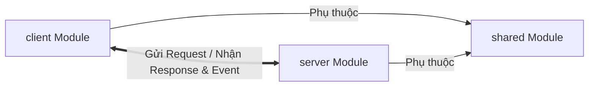
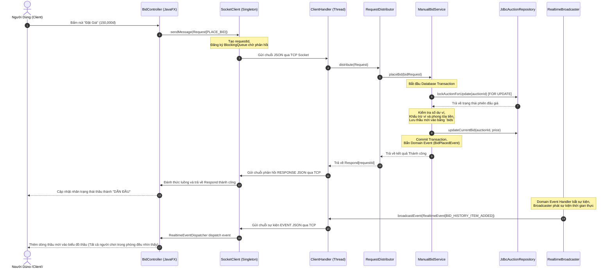

# Thiết Kế Lớp & Bản Đồ Module vBay

Hệ thống vBay được tổ chức chặt chẽ theo mô hình thiết kế hướng đối tượng (OOP) sạch, phân tách rõ ràng trách nhiệm của từng thành phần. Bản vẽ cấu trúc dưới đây giải trình chi tiết mối quan hệ giữa các lớp phần mềm và gói (packages) trong 3 module Maven chính: `shared`, `server` và `client`.

---

## 1. Cấu Trúc Tổng Thể Hệ Thống (Module Map)

Kiến trúc liên kết giữa các module và luồng truyền dữ liệu được minh họa như sau:



---

## 2. Chi Tiết Các Gói & Lớp Trong Từng Module

### A. Module `shared` (Thư viện dùng chung)
Gói này chứa định nghĩa giao thức giao tiếp và các thực thể dữ liệu được biên dịch chung cho cả Client và Server:

```text
com.vbay.shared/
├── protocol/
│   ├── Request.java          - Định nghĩa cấu trúc yêu cầu chứa RequestType và Payload
│   ├── Respond.java          - Định nghĩa cấu trúc phản hồi chứa trạng thái và Dữ liệu trả về
│   └── RealtimeEvent.java    - Định nghĩa cấu trúc sự kiện thời gian thực
├── enums/
│   ├── MessageType.java      - [REQUEST, RESPONSE, EVENT]
│   ├── RequestType.java      - Enum chứa 62 loại hành động nghiệp vụ
│   └── auction/, auth/, bid/, payment/, product/, realtime/ - Các enums trạng thái nghiệp vụ
├── dto/
│   ├── authDTO/              - LoginRequest, LoginResponse, RegisterRequest, UserDTO
│   ├── auctionDTO/           - CreateAuctionRequest, PlaceBidRequest, BuyNowRequest
│   └── realtimeDTO/          - Room, RoomFilter, các gói tin Payload sự kiện thời gian thực
└── Utils/
    ├── IDGenerator.java      - Tạo mã ngẫu nhiên UUID ngắn duy nhất
    ├── JsonUtils.java        - Serialization/Deserialization Gson
    └── LoggingUtils.java     - Cấu hình Log hệ thống
```

---

### B. Module `server` (Động cơ máy chủ TCP & Nghiệp vụ)
Gói này chứa toàn bộ logic xử lý luồng, cơ sở dữ liệu và phân phối sự kiện:

```text
com.vbay.server/
├── ServerApplication.java     - Lớp khởi chạy hệ thống, quản lý ServerSocket và luồng kết nối
├── AppConfig.java             - Composite Root quản lý Dependency Injection (DI) thủ công
├── databaseManager/
│   ├── ConnectionProvider.java- Giao diện cung cấp Connection JDBC
│   ├── DatabaseConfig.java    - Cấu hình tham số kết nối MySQL cục bộ
│   ├── DatabaseConnection.java- Cấp Connection thô qua DriverManager
│   └── DatabaseInitializer.java- Khởi tạo Database, bảng từ data_init.sql, và tạo Indexes
├── network_connection/
│   ├── ClientHandler.java     - Luồng xử lý kết nối TCP riêng biệt cho từng Client (Runnable)
│   ├── ClientConnection.java  - Đại diện cho 1 kết nối Client đang hoạt động
│   ├── ClientConnectionRegistry.java - Quản lý danh sách các Client đang Online
│   └── RequestDistributor.java- Router phân phối yêu cầu tới các Service tương ứng
├── repository/ (Mô hình DAO/Repository JDBC)
│   ├── RepositoryFactory.java - Nhà máy cấp phát repositories
│   ├── JDBCrepository/        - Lớp triển khai cụ thể: JdbcUserRepository, JdbcAuctionRepository, ...
│   └── [Entity]Repository.java- Định nghĩa các giao diện nghiệp vụ DB
├── service/
│   ├── AuthService.java       - Đăng ký, đăng nhập tài khoản sử dụng băm Argon2
│   ├── AuctionService.java    - Nghiệp vụ tạo, quản lý và lên lịch phiên đấu giá
│   ├── UserAccountService.java- Quản lý số dư, nạp tiền
│   ├── AdminService.java      - Xử lý khóa tài khoản, duyệt ví tiền, can thiệp phiên thầu
│   └── bid/
│       ├── ManualBidService.java - Xử lý lượt thầu thủ công từ người dùng
│       ├── AutobidService.java   - Động cơ đặt giá thầu tự động Proxy Bid
│       └── BuyNowService.java    - Xử lý nghiệp vụ mua đứt ngay lập tức
└── realtime/ (Hệ thống sự kiện trực tiếp)
    ├── transport/             - RealtimeBroadcaster (Phát thông tin sự kiện ra Socket)
    ├── subscription/          - SubscriptionService (Quản lý đăng ký phòng thầu)
    └── handler/               - Các lớp bắt sự kiện miền (Domain Events) như BidUpdatedRealtimeHandler
```

---

### C. Module `client` (Giao diện JavaFX Desktop App)
Gói này chịu trách nhiệm hiển thị giao diện và giao tiếp mạng phía Client:

```text
com.vbay/
├── network/
│   ├── SocketClient.java      - Đối tượng Singleton duy nhất duy trì kết nối TCP Socket
│   ├── image/
│   │   └── ImageUploadClient.java - Client HTTP tải ảnh sản phẩm lên server
│   ├── message/
│   │   ├── ServerMessage.java - Đại diện thông điệp nhận từ server
│   │   └── ServerMessageParser.java - Giải mã chuỗi JSON từ dòng TCP
│   └── dispatcher/
│       └── RealtimeEventDispatcher.java - Điều phối sự kiện bất đồng bộ đến các màn hình JavaFX
└── ui/scene_ui/controller/ (Giao diện MVC JavaFX)
    ├── home/HomeController.java         - Quản lý trang chủ danh sách phòng đấu giá
    ├── auth/LoginController.java        - Màn hình đăng nhập tài khoản
    ├── bid/BidController.java           - Màn hình phòng đấu giá trực tiếp thời gian thực
    ├── admin/AdminDashboardController.java - Bảng điều khiển quản trị viên
    └── card/AuctionCardController.java  - Màn hình nhỏ thể hiện phiên đấu giá riêng lẻ
```

---

## 3. Luồng Cộng Tác Giữa Các Lớp (Collaboration Flow)

Dưới đây là sơ đồ Sequence thể hiện luồng làm việc khi một Bidders bấm nút "Đặt Giá" trên giao diện:


