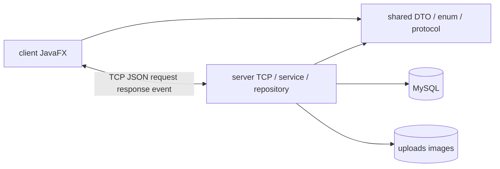
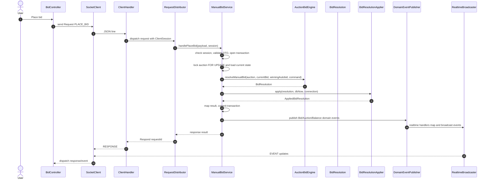
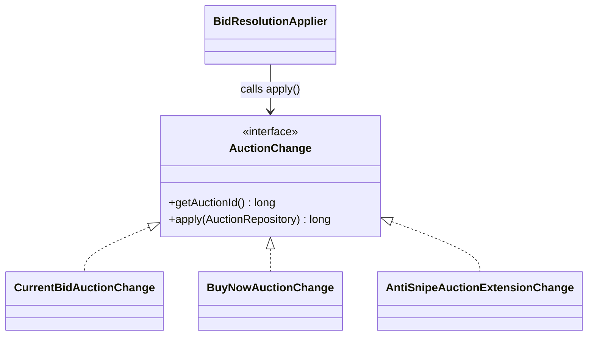

# Thiết Kế Lớp Và Bản Đồ Module vBay

Tài liệu này mô tả cấu trúc class/module chính của vBay. Các rule chi tiết của bidding và auto-bid được tách sang `bidding-architecture.md`; file này chỉ giữ bản đồ lớp và sequence flow tổng quan.

## 1. Module Map



## 2. Server Packages

```text
com.vbay.server/
├── ServerApplication.java
├── AppConfig.java
├── databaseManager/
│   ├── DatabaseConfig.java
│   ├── DatabaseConnection.java
│   └── DatabaseInitializer.java
├── network_connection/
│   ├── ClientHandler.java
│   ├── ClientConnection.java
│   ├── ClientSession.java
│   ├── ClientConnectionRegistry.java
│   └── RequestDistributor.java
├── security/
│   ├── Argon2PasswordHasher.java
│   ├── PasswordHasher.java
│   └── PasswordPolicy.java
├── scheduler/
│   ├── AuctionTaskScheduler.java
│   └── AuctionScheduleDomainEventHandler.java
├── repository/
│   ├── RepositoryFactory.java
│   ├── [Entity]Repository.java
│   └── JDBCrepository/
├── realtime/
│   ├── domain/
│   ├── handler/
│   ├── mapper/
│   ├── publisher/
│   ├── subscription/
│   └── transport/
├── service/
│   ├── AuthService.java
│   ├── AuctionService.java
│   ├── UserAccountService.java
│   ├── AdminService.java
│   └── bid/
│       ├── ManualBidService.java
│       ├── AutobidService.java
│       ├── BuyNowService.java
│       ├── BidQueryService.java
│       ├── engine/
│       │   ├── AuctionBidEngine.java
│       │   └── AntiSnipePolicy.java
│       └── resolution/
│           ├── BidResolutionApplier.java
│           ├── AppliedBidResultMapper.java
│           └── model/
└── upload/
    ├── ImageHttpServer.java
    └── ImageStorageService.java
```

Các điểm chính:

- `ClientSession` là nguồn identity của request lifecycle sau login.
- `AuctionTaskScheduler` quản lý start/end/recovery task; `AuctionScheduleDomainEventHandler` reschedule khi nhận event có reason ảnh hưởng thời gian.
- Bidding dùng pipeline riêng: service orchestration, `AuctionBidEngine` quyết định nghiệp vụ, `BidResolutionApplier` ghi DB.
- Realtime tách domain event, mapper, handler và broadcaster để service không ghi socket trực tiếp.

## 3. AppConfig As Composition Root

`AppConfig` là Composition Root của server. Đây là nơi khởi tạo dependency graph chính của ứng dụng thay vì để từng service tự tạo dependency nội bộ.

Các nhóm object được nối tại `AppConfig`:

- Hạ tầng: `ConnectionProvider`, `RepositoryFactory`, `ImageStorageService`, `PasswordHasher`.
- Business service: `AuthService`, `AuctionService`, `UserAccountService`, `AdminService`, `ManualBidService`, `AutobidService`, `BuyNowService`, `BidQueryService`.
- Bidding pipeline: `AuctionBidEngine`, `AntiSnipePolicy`, `BidResolutionApplier`.
- Realtime: `SubscriptionRegistry`, `RealtimeBroadcaster`, `RealtimeEventMapper`, `InMemoryDomainEventPublisher`, các `DomainEventHandler`.
- Scheduler: `AuctionTaskScheduler` và `AuctionScheduleDomainEventHandler`.
- Network entrypoint: `RequestDistributor` nhận các service đã được inject và phân phối request từ `ClientHandler`.

Cách tổ chức này giữ dependency injection theo constructor: service nhận dependency cần dùng, nhưng không tự quyết định cách khởi tạo dependency đó. Nhờ vậy cấu hình runtime được tập trung hơn, test có thể truyền `ConnectionProvider`, `RepositoryFactory`, `PasswordHasher` hoặc `AntiSnipeSettings` khác, và việc thêm service/handler mới có một điểm wiring rõ ràng.

Ví dụ với anti-snipe, `AppConfig.DEFAULT_ANTI_SNIPE_SETTINGS` giữ cấu hình mặc định, `AntiSnipeSettings` validate thông số, sau đó `AppConfig` chuyển settings thành `AntiSnipePolicy` và inject vào `AuctionBidEngine`. Engine chỉ dùng policy đã nhận, không tự đọc cấu hình và không tự tạo policy mặc định cho runtime chính.

## 4. Client Packages

```text
com.vbay/
├── MainApp.java
├── Launcher.java
├── network/
│   ├── SocketClient.java
│   ├── dispatcher/RealtimeEventDispatcher.java
│   ├── message/ServerMessageParser.java
│   └── image/ImageUploadClient.java
└── ui/
    ├── model/
    └── scene_ui/controller/
        ├── auth/
        ├── home/
        ├── auction/
        ├── bid/
        ├── admin/
        ├── deposit/
        └── card/
```

Client controller thường theo vòng đời:

1. Fetch snapshot từ server.
2. Render snapshot.
3. Subscribe room/event cần thiết.
4. Merge realtime event bằng `auctionVersion`, `version` hoặc `updatedAt`.
5. Dispose thì unsubscribe, stop timer và bỏ state màn.

## 5. Bid Flow Sequence



## 6. AuctionChange Polymorphism



`BidResolutionApplier` không cần biết từng loại auction change làm gì. Nó chỉ duyệt `resolution.getAuctionChanges()` và gọi `apply(...)`; logic update cụ thể nằm trong class implement `AuctionChange`.
