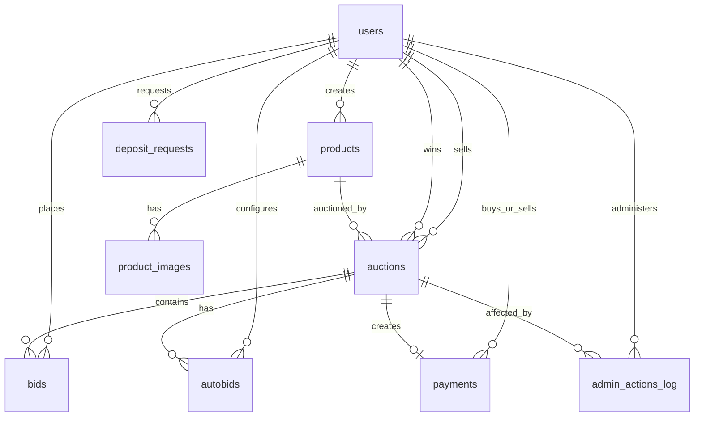

# Thiết Kế Cơ Sở Dữ Liệu MySQL vBay

Database của vBay được khởi tạo từ `server/src/main/resources/data_init.sql`. Thiết kế tập trung vào tính nhất quán của auction, lịch sử bid, ví nội bộ và các thao tác admin.

## 1. ERD

## 2. Các Bảng Chính

### `users`

Lưu tài khoản và ví nội bộ.

| Cột | Ý nghĩa |
| :--- | :--- |
| `id` | Primary key |
| `username`, `email` | Định danh duy nhất |
| `password_hash` | Mật khẩu đã băm bằng Argon2 |
| `phone_number` | Số điện thoại tùy chọn |
| `position` | `USER` hoặc `ADMIN` |
| `status` | `ACTIVE`, `SUSPENDED`, `BANNED`, `LOCKED`, `DELETED` |
| `available_balance` | Số dư có thể sử dụng |
| `hold_balance` | Số dư đang bị giữ cho bid/auto-bid |
| `warning_count`, `lock_until` | Dữ liệu quản trị user |
| `version` | Tăng khi balance/status thay đổi |

### `products`

Lưu sản phẩm do user tạo để đưa vào auction.

| Cột | Ý nghĩa |
| :--- | :--- |
| `seller_id` | FK đến `users.id`, user tạo sản phẩm |
| `name`, `description` | Thông tin hiển thị |
| `category_id`, `product_condition` | Phân loại sản phẩm |
| `status` | Trạng thái sản phẩm, mặc định `AVAILABLE` |
| `version` | Version của product |

### `product_images`

Lưu các image URL của product.

| Cột | Ý nghĩa |
| :--- | :--- |
| `product_id` | FK đến `products.id` |
| `image_url` | Đường dẫn ảnh |
| `is_thumbnail` | Ảnh đại diện của product |

### `auctions`

Bảng trung tâm của nghiệp vụ đấu giá.

| Cột | Ý nghĩa |
| :--- | :--- |
| `product_id`, `seller_id` | Product và user bán |
| `title`, `description` | Nội dung hiển thị |
| `minimum_bid_step` | Bước giá tối thiểu |
| `starting_price`, `current_price`, `final_price` | Giá khởi điểm, hiện tại, kết thúc |
| `reserve_price`, `buy_now_price` | Giá sàn và giá mua ngay tùy chọn |
| `starting_time`, `ending_time` | Thời gian mở/đóng auction |
| `status` | `SCHEDULED`, `ACTIVE`, `STOPPED`, `ENDED`, `FAILED`, `CANCELLED` |
| `winner_user_id` | User đang thắng hoặc thắng cuối cùng |
| `anti_snipe_extension_count` | Số lần gia hạn anti-snipe |
| `version` | Tăng khi state/price thay đổi |

### `bids`

Lưu lịch sử đặt giá.

| Cột | Ý nghĩa |
| :--- | :--- |
| `auction_id` | FK đến auction |
| `bidder_id` | FK đến user đặt bid |
| `bid_amount` | Số tiền bid |
| `bid_source` | `USER_BID`, `AUTO_BID`, `BUY_NOW` nếu code tạo bid nguồn buy now |
| `status` | `WINNING`, `OUTBID`, `LOST`, `WON` |

### `autobids`

Lưu hợp đồng auto-bid/proxy bid của user trong một auction.

| Cột | Ý nghĩa |
| :--- | :--- |
| `auction_id`, `user_id` | Unique theo auction và user |
| `max_bid_amount` | Mức tối đa user chấp nhận trả |
| `status` | `WINNING`, `LOST`, `WON`, `CANCELLED` |

### `payments`

Lưu giao dịch thanh toán sau khi auction sold hoặc buy now.

| Cột | Ý nghĩa |
| :--- | :--- |
| `auction_id` | Unique, mỗi auction tối đa một payment |
| `buyer_id`, `seller_id` | Bên mua và bên bán |
| `winning_bid_id` | Bid chiến thắng, nullable theo FK |
| `amount` | Số tiền thanh toán |
| `type` | `AUCTION_WIN`, `BUY_NOW` |
| `status` | `HELD`, `RELEASED`, `REFUNDED`, `FAILED`, `CANCELLED` |
| `held_at`, `released_at`, `refunded_at` | Mốc thời gian payment |

### `admin_actions_log`

Ghi log thao tác quản trị.

| Cột | Ý nghĩa |
| :--- | :--- |
| `admin_id` | Admin thực hiện |
| `target_user_id`, `target_auction_id` | Đối tượng bị tác động |
| `action_type` | Loại hành động: ban, kick, lock, warn, stop/delete auction... |
| `reason` | Lý do xử lý |

### `deposit_requests`

Lưu yêu cầu nạp tiền cho admin duyệt.

| Cột | Ý nghĩa |
| :--- | :--- |
| `user_id` | User gửi yêu cầu |
| `amount` | Số tiền nạp |
| `status` | `PENDING`, `APPROVED`, `REJECTED` |
| `admin_id` | Admin xử lý |
| `created_at`, `processed_at` | Thời điểm tạo và xử lý |

## 3. Transaction Và Concurrency

- Bid, buy now và auto-bid lock auction bằng `SELECT ... FOR UPDATE`.
- Balance update được thực hiện trong cùng transaction với bid/auction update.
- `available_balance` và `hold_balance` có điều kiện SQL để tránh số dư âm.
- `version` trên `users`, `products`, `auctions` hỗ trợ client nhận biết data mới/cũ trong realtime payload.

## 4. Indexes

`DatabaseInitializer` tạo các index phụ trợ:

- `idx_auctions_status`
- `idx_auctions_seller_id`
- `idx_auctions_status_starting_time`
- `idx_auctions_status_ending_time`

Nhóm index này hỗ trợ query danh sách auction, my auction và scheduler recover/start/end.
