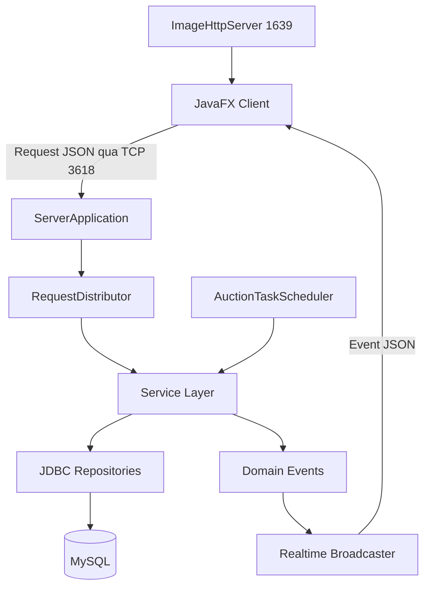

# vBay - Hệ Thống Đấu Giá Trực Tuyến Thời Gian Thực

vBay là ứng dụng đấu giá trực tuyến desktop được xây dựng bằng Java, JavaFX, TCP Socket và MySQL. Hệ thống tập trung vào các bài toán cốt lõi của đấu giá: đặt giá realtime, quản lý ví nội bộ, auto-bid, buy now, lập lịch auction và xử lý đồng thời an toàn.

Dự án được tổ chức thành multi-module Maven project:

```text
vbay/
├── shared/   - DTO, enum, protocol, utility dùng chung
├── server/   - TCP server, service nghiệp vụ, repository JDBC, scheduler, realtime
└── client/   - JavaFX app, socket client, FXML controller, CSS
```

## 1. Phạm Vi Hệ Thống

### Người Dùng Và Phân Quyền

App hiện tại có 2 role tài khoản:

- `USER`: tài khoản người dùng thông thường. Một `USER` có thể tạo auction của mình và cũng có thể bid auction của người khác.
- `ADMIN`: tài khoản quản trị hệ thống, có dashboard riêng để quản lý user, auction và deposit request.

Vai trò `seller` và `bidder` không phải role tài khoản riêng. Chúng được xác định theo dữ liệu nghiệp vụ:

- Seller của auction là `auctions.seller_id`.
- Bidder của một lượt đặt giá là `bids.bidder_id`.

### Tính Năng Chính

- Đăng ký, đăng nhập, logout và quản lý session socket.
- Tạo auction kèm product, image, starting price, minimum bid step, reserve price, buy now price và thời gian chạy.
- Hiển thị danh sách auction, chi tiết auction, lịch sử bid và danh sách bid của user.
- Đặt giá thủ công, auto-bid/proxy bid, tăng max auto-bid và buy now.
- Ví nội bộ với `available_balance` và `hold_balance`.
- Deposit request cho user, admin approve/reject deposit.
- Admin ban, kick, lock, warn user và stop/continue/delete auction.
- Realtime update qua TCP event room.
- Scheduler tự động start/end auction và có cơ chế recover missed schedules.

## 2. Yêu Cầu Chức Năng

| Nhóm | Yêu cầu |
| :--- | :--- |
| Authentication | Đăng ký, đăng nhập, tự động tạo/restore admin mặc định, băm mật khẩu bằng `Argon2PasswordHasher` |
| Auction | Tạo auction, xem danh sách, xem chi tiết, đồng bộ trạng thái theo thời gian |
| Bidding | Place bid, buy now, auto-bid, increase auto-bid max, xem bid history |
| Wallet | Deposit request, hold/release balance, cập nhật balance realtime |
| Admin | Quản lý user, auction, deposit request và ghi `admin_actions_log` |
| Realtime | Subscribe/unsubscribe room, broadcast auction state, bid history, balance, autobid, admin event |

## 3. Bảo Mật Và Session

Server dùng `ClientSession` gắn với từng socket connection để xác định user hiện tại. Sau khi login thành công, `AuthService` set `userId`, `username` và `Position` vào session; khi logout hoặc socket đóng, session được clear.

Nguyên tắc chính:

- Service không giao quyền validate định danh hoặc quyền sở hữu dữ liệu cho client.
- Các flow nghiệp vụ lấy user hiện tại từ `session.getUserId()`, ví dụ tạo auction dùng session làm seller, place bid dùng session làm bidder, deposit dùng session làm owner của deposit request.
- Các request cần đăng nhập đều gọi `checkSession(...)` hoặc validate tương đương trước khi xử lý.
- Admin flow kiểm tra `session.getPosition() == ADMIN`, không chỉ dựa vào request client gửi.
- Room `USER` là room riêng tư; `targetId` của room phải bằng `session.getUserId()`, nếu không server từ chối subscribe.
- `maxBidAmount`, balance và my-bid state chỉ được gửi qua response riêng của user hoặc room `USER`, không gửi vào public room.

Client chỉ gửi intent và input cho thao tác; mọi kiểm tra định danh, phân quyền, quyền sở hữu dữ liệu và rule nghiệp vụ đều được validate ở server. Server xem `ClientSession` là nguồn identity tin cậy trong request lifecycle, còn payload từ client luôn phải đi qua validation trước khi được xử lý.

## 4. Business Rules & Invariants

- User không được bid auction do chính mình tạo.
- Khi tạo auction, `reserve_price` nếu có phải lớn hơn `starting_price`; `buy_now_price` nếu có và có reserve thì phải lớn hơn hoặc bằng `reserve_price`.
- Auction chỉ nhận bid khi đang mở: `SCHEDULED` chưa tới giờ start bị từ chối, auction đã closed bị từ chối.
- Bid đầu tiên có thể bằng `starting_price`; các bid tiếp theo phải đạt tối thiểu `current_price + minimum_bid_step`.
- Bid thấp hơn reserve vẫn có thể được ghi nhận là bid đang thắng tạm thời, nhưng chưa đủ điều kiện thắng cuối cùng.
- `reserveMet` là trạng thái suy ra từ `reserve_price` và `current_price`: `null` nếu không có reserve, `true` nếu `current_price >= reserve_price`, ngược lại là `false`.
- Buy now chỉ hợp lệ khi auction có `buy_now_price` và chưa đóng; buy now tạo payment `HELD` theo `PaymentType.BUY_NOW`.
- Khi có winning bid thủ công, server hold đúng `bid_amount`.
- Khi auto-bid đang thắng, server hold `max_bid_amount`; khi auction kết thúc, release max trước rồi charge đúng `final_price`.
- Nếu max auto-bid chạm hoặc vượt reserve, engine có thể đẩy bid thực tế lên `reserve_price` để chuyển auction sang trạng thái reserve met.
- Khi bị outbid, hold của người thắng cũ phải được release trong cùng transaction.
- Khi auction hết giờ mà không có winner hoặc `reserve_price` không đạt, auction kết thúc ở trạng thái `FAILED`; bid tạm thắng bị mark lost và hold liên quan được release.
- Khi auction hết giờ và reserve đã đạt hoặc không có reserve, auction kết thúc ở trạng thái `ENDED`; winning bid chuyển `WON`, payment `AUCTION_WIN` được tạo ở trạng thái `HELD`.
- Mọi flow bid/buy now/auto-bid lock auction bằng `FOR UPDATE` để tránh double-spending và race condition.
- Public realtime room không được expose maxBidAmount.

## 5. Kiến Trúc Tổng Quan



## 6. Công Nghệ

- Java 25, Maven 3.9+.
- JavaFX 25.0.2 cho client desktop.
- TCP Socket line-delimited JSON cho request/response/event.
- Gson/Jackson cho JSON.
- MySQL Connector/J và JDBC repository.
- H2 in-memory `MODE=MySQL` cho integration test.
- Argon2 cho password hashing.
- JUnit 5 cho test.
