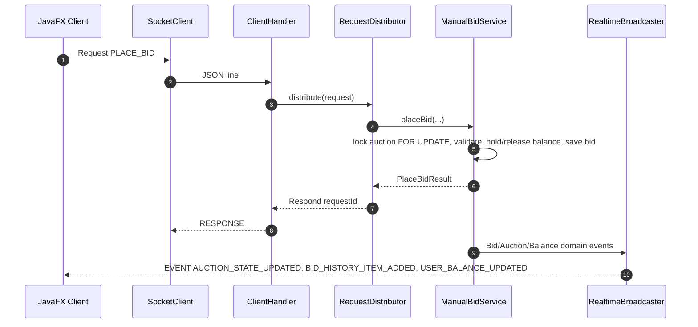

# Giao Thức TCP Socket Và Định Dạng Dữ Liệu vBay

vBay dùng TCP Socket persistent connection. Mỗi message là JSON một dòng, client và server phân biệt message bằng trường `messageType`.

## 1. Message Types

### Request

```json
{
  "messageType": "REQUEST",
  "requestType": "PLACE_BID",
  "requestId": "req_123",
  "payload": {
    "auctionId": 10,
    "bidAmount": 150000.00
  }
}
```

- `requestType` là enum `RequestType`.
- `requestId` dùng để match response với request đang chờ.
- `payload` là DTO tương ứng với request.

### Respond

```json
{
  "messageType": "RESPONSE",
  "requestId": "req_123",
  "status": true,
  "message": "Bid placed successfully",
  "data": {
    "auctionId": 10,
    "currentPrice": 150000.00
  }
}
```

- `status = true` khi thành công, `false` khi có lỗi nghiệp vụ.
- `data` có thể null hoặc là response DTO.

### RealtimeEvent

```json
{
  "messageType": "EVENT",
  "eventId": "evt_123",
  "type": "AUCTION_STATE_UPDATED",
  "room": {
    "type": "AUCTION",
    "targetId": 10
  },
  "payload": {
    "auctionId": 10,
    "currentPrice": 150000.00,
    "winnerUserId": 2
  },
  "occurredAt": "2026-05-26T10:30:00"
}
```

- `type` là enum `RealtimeEventType`.
- `room.type` là enum `RoomType`: `AUCTION`, `USER`, `AUCTION_LIST`.
- Event được client parse tại `ServerMessageParser` và dispatch bằng `RealtimeEventDispatcher`.

## 2. Session Boundary Và Identity

`requestId` và `payload` do client gửi chỉ mô tả thao tác và dữ liệu đầu vào. Server là trust boundary của hệ thống: định danh, phân quyền, quyền sở hữu dữ liệu và business rule đều được validate lại ở server trước khi xử lý.

Các rule quan trọng:

- Sau `LOGIN`, server lưu `userId`, `username`, `Position` vào `ClientSession`.
- Các service cần đăng nhập phải kiểm tra `session.isAuthenticated()`.
- Flow cá nhân như `PLACE_BID`, `AUTO_BID`, `INCREASE_AUTOBID_MAX`, `BUY_NOW`, `DEPOSIT_BALANCE`, `GET_MY_BID_LIST` dùng `session.getUserId()` làm user thực hiện.
- Các trường định danh nghiệp vụ như bidder, seller, owner deposit hoặc owner auto-bid phải được suy ra/kiểm tra ở server theo session và dữ liệu trong database.
- Admin request được kiểm tra bằng `session.getPosition() == ADMIN`.
- Với room `USER`, `room.targetId` phải bằng `session.getUserId()`. Nếu client subscribe `USER:{id khác}`, server trả lỗi.

Ví dụ request place bid chỉ gửi auction và số tiền bid:

```json
{
  "messageType": "REQUEST",
  "requestType": "PLACE_BID",
  "requestId": "req_123",
  "payload": {
    "auctionId": 10,
    "bidAmount": 150000.00
  }
}
```

Server sẽ lấy bidder từ session hiện tại:

```text
bidderId = session.getUserId()
```

## 3. RequestType Chính

| Nhóm | RequestType |
| :--- | :--- |
| Account | `REGISTER`, `LOGIN`, `LOGOUT`, `FORGOT_PASSWORD`, `VERIFY`, `UPDATE_PROFILE` |
| Auction lifecycle | `CLOSE_AUCTION`, `DECLARE_WINNER`, `NOTIFY_WINNER` |
| Auction query/subscription | `GET_AUCTION_LIST`, `GET_AUCTION_DETAIL`, `SEARCH_AUCTION`, `FILTER_AUCTION`, `SUBSCRIBE_ROOM`, `UNSUBSCRIBE_ROOM`, `GET_BID_HISTORY` |
| Bidder flow | `GET_MY_BID_LIST`, `JOIN_AUCTION`, `PLACE_BID`, `BUY_NOW`, `AUTO_BID`, `INCREASE_AUTOBID_MAX`, `CANCEL_BID`, `WATCH_AUCTION`, `QUIT_AUCTION` |
| Payment/wallet | `CREATE_PAYMENT`, `DEPOSIT_BALANCE`, `PAY_DEPOSIT`, `PAY_REST`, `VERIFY_PAYMENT`, `RETURN_DEPOSIT` |
| Seller flow | `UPLOAD_IMAGE`, `CREATE_AUCTION`, `CANCEL_AUCTION` |
| Admin | `ADMIN_GET_ALL_USERS`, `ADMIN_BAN_USER`, `ADMIN_KICK_USER`, `ADMIN_LOCK_USER`, `ADMIN_WARN_USER`, `ADMIN_DELETE_AUCTION`, `ADMIN_STOP_AUCTION`, `ADMIN_CONTINUE_AUCTION`, `ADMIN_GET_ALL_AUCTIONS`, `ADMIN_GET_PENDING_DEPOSITS`, `ADMIN_APPROVE_DEPOSIT`, `ADMIN_REJECT_DEPOSIT` |

Một số enum có trong `RequestType` là dự phòng hoặc chưa có UI đầy đủ; tài liệu vẫn liệt kê theo enum để đồng bộ code.

## 4. RealtimeEventType Và RoomType

| Event | Room | Mục đích |
| :--- | :--- | :--- |
| `AUCTION_STATE_UPDATED` | `AUCTION` | Cập nhật status, current price, winner, time |
| `BID_HISTORY_ITEM_ADDED` | `AUCTION` | Thêm bid mới vào lịch sử bid |
| `MY_BID_LIST_ITEM_UPDATED` | `USER` | Cập nhật item trong danh sách bid cá nhân |
| `NOTIFICATION_CREATED` | `USER` | Thông báo cá nhân |
| `AUCTION_LIST_ITEM_UPDATED` | `AUCTION_LIST` | Cập nhật card/list item ngoài Home |
| `USER_BALANCE_UPDATED` | `USER` | Cập nhật available/hold balance |
| `WATCHER_COUNT_CHANGED` | `AUCTION` | Cập nhật số người theo dõi auction |
| `ADMIN_USER_KICKED` | `USER` | Yêu cầu user bị kick xử lý logout/UI |
| `ADMIN_USER_STATUS_CHANGED` | `USER` | Cập nhật status user do admin tác động |
| `DEPOSIT_REQUEST_UPDATED` | `USER` | Báo kết quả approve/reject deposit |
| `ADMIN_DEPOSIT_REQUESTED` | `AUCTION_LIST` | Báo admin có deposit request mới |
| `ADMIN_USER_WARNED` | `USER` | Cảnh báo user |
| `AUTOBID_UPDATED` | `USER` | Cập nhật auto-bid của user |

## 5. Flow Place Bid


