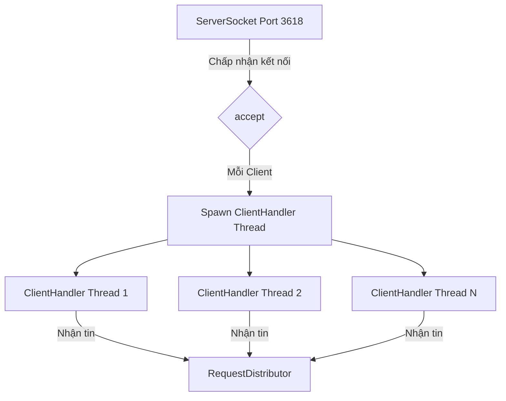
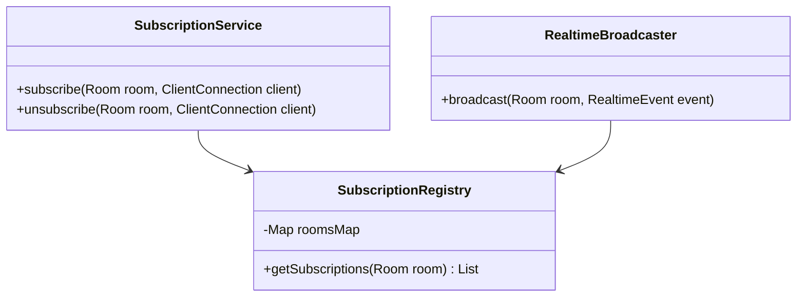

# Kiến Trúc Real-time & Xử Lý Đồng Thời vBay

Đấu giá trực tuyến đòi hỏi tốc độ truyền tải thông tin cực kỳ nhanh và khả năng kiểm soát concurrency tuyệt đối an toàn. Tài liệu này mô tả chi tiết giải pháp kiến trúc đa luồng, cơ chế phòng đăng ký sự kiện (Real-time Rooms), trình lập lịch tự phục hồi (Task Scheduler), và lõi đấu giá tự động (Auto-bid Engine) của vBay Server.

---

## 1. Kiến Trúc Đa Luồng TCP Server (TCP Concurrency)

Server của vBay chạy song song hàng loạt dịch vụ mạng để duy trì kết nối ổn định:

*   **`ServerApplication`**: Duy trì một vòng lặp vô hạn `while(true) { Socket socket = serverSocket.accept(); ... }` trên luồng chính để tiếp nhận kết nối mới.
*   **`ClientHandler`**: Với mỗi Socket kết nối thành công, Server tạo ra một luồng xử lý riêng biệt chạy độc lập dưới dạng `Runnable`. Luồng này duy trì việc đọc dòng dữ liệu JSON từ Client, điều phối tới `RequestDistributor` để thực thi nghiệp vụ, và phản hồi kết quả trực tiếp qua mạng.

---

## 2. Cơ Chế Phòng Đăng Ký (Room-based Broadcasting)

Để giảm thiểu băng thông truyền tải và tránh spam dữ liệu tới các người dùng không liên quan, vBay triển khai cơ chế **Room Subscription** (Đăng ký nhận tin theo phòng):

### A. Phân Loại Phòng (`RoomType`)
1.  **`AUCTION_LIST`**: Phòng toàn cục. Bất kỳ sự thay đổi giá thầu hay trạng thái nào ngoài trang chủ đều được phát vào phòng này để tất cả các Client đang duyệt danh sách cập nhật trực tiếp Card hiển thị.
2.  **`AUCTION` (Mã phiên)**: Phòng đấu giá chi tiết. Khi người dùng bấm vào xem một sản phẩm, Client gửi yêu cầu `SUBSCRIBE_ROOM` với mã phiên đấu giá. Mọi sự kiện liên quan đến phiên (lượt thầu mới, watcher count, chống bắn tỉa anti-snipe) chỉ được phát tới những người trong phòng này.
3.  **`USER` (Mã người dùng)**: Phòng cá nhân. Chỉ phát các thông tin bảo mật, riêng tư như thay đổi số dư ví, phê duyệt nạp tiền, hoặc cảnh cáo từ admin đến đúng Client của người dùng đó.

### B. Thực Thi `SubscriptionRegistry`
Server sử dụng cấu trúc `ConcurrentHashMap` lưu trữ danh sách đăng ký. Khi phát sinh một sự kiện mới, `RealtimeBroadcaster` lấy danh sách các kết nối client thuộc về phòng đó và viết dữ liệu JSON trực tiếp vào luồng output Socket của từng client.

---

## 3. Trình Lập Lịch Tự Phục Hồi (Auction Task Scheduler)

Phiên đấu giá phải tự động đổi trạng thái từ lên lịch (`SCHEDULED`) sang trực tiếp (`ACTIVE`) và tự động kết thúc (`ENDED`/`FAILED`) chính xác từng mili-giây. vBay xây dựng một **`AuctionTaskScheduler`** cực kỳ thông minh:

*   **Động Cơ Lập Lịch (`ScheduledExecutorService`)**: Sử dụng một Thread Pool cố định gồm **4 luồng nền** để chuyên trách việc lập lịch và đếm ngược thời gian.
*   **Lập Lịch Chờ (`scheduleStart` & `scheduleEnd`)**:
    *   Khi một phiên đấu giá mới được tạo, hệ thống tính toán khoảng thời gian delay từ hiện tại đến giờ mở/đóng cửa và đưa vào hàng chờ lập lịch.
    *   Hai bản đồ luồng an toàn (`ConcurrentHashMap`) là `startTasks` và `endTasks` được dùng để lưu vết các `ScheduledFuture<?>` đang đếm ngược. Nếu seller cập nhật lại thời gian đấu giá hoặc Admin hủy phiên thầu, hệ thống dễ dàng hủy (`cancel`) tiến trình lập lịch cũ để tránh chạy sai giờ.
*   **Cơ Chế Tự Phục Hồi Lỗi (Self-Healing Recovery Engine)**:
    *   Cứ mỗi **30 giây**, một luồng nền định kỳ (`scheduleAtFixedRate`) sẽ quét cơ sở dữ liệu để kiểm tra xem có phiên đấu giá nào bị trôi qua giờ mở/đóng mà chưa được đổi trạng thái hay không (ví dụ: do Server bị mất điện, crash đột ngột dẫn đến mất hàng đếm ngược trong RAM).
    *   Lớp phục hồi (`recoverMissedAuctions`) tự động đồng bộ hóa trạng thái phiên đấu giá về đúng thực tế và lập lịch lại các phiên đang dang dở, giúp hệ thống phục hồi 100% dữ liệu sạch sau sự cố.

---

## 4. Động Cơ Đấu Giá Tự Động (Auto-Bid Engine)

Động cơ Auto-bid (`AutobidService` kết hợp `AuctionBidEngine`) chạy hoàn toàn trên bộ nhớ của Server với các cam kết an toàn tài chính cực cao:

1.  **Kích Hoạt Tự Động**: Khi có một lượt đặt giá thủ công mới thành công, hệ thống bắn ra sự kiện `BidPlacedEvent`.
2.  **Xử Lý Đệ Quy (Auto-bid Competition)**:
    *   Hệ thống quét bảng `autobids` tìm xem có người nào đang cấu hình tự động cho phiên đấu giá này hay không.
    *   Nếu có, nó sẽ tự động thay mặt người dùng đó đặt một mức giá thầu mới bằng: **Giá thầu cao nhất hiện tại + Bước giá tối thiểu**.
    *   Nếu có nhiều hơn một người cấu hình Auto-bid cạnh tranh nhau, Server sẽ lập tức tính toán lượt đặt giá đấu tranh qua lại cho đến khi:
        *   Một bên đạt giới hạn tối đa (`max_bid_amount`) của mình.
        *   Người có giới hạn cao hơn sẽ là người dẫn đầu phiên thầu với mức giá bằng: **Giới hạn của người thua cuộc + Bước giá tối thiểu**.
3.  **Thread-Safety**: Toàn bộ luồng tính toán Auto-bid cạnh tranh được bọc trong một Database Transaction duy nhất với cơ chế khóa bi quan `FOR UPDATE` trên dòng phiên đấu giá. Điều này đảm bảo tuyệt đối không có hai luồng xử lý tranh chấp số tiền ví hoặc ghi đè lịch sử đặt thầu của nhau.

---

## 5. Các Kỹ Thuật Đảm Bảo Thread-Safety Trên Server

Do hàng ngàn Client gửi request lên đồng thời, Server vBay áp dụng các kỹ thuật lập trình thread-safety tiên tiến:

*   **Luồng dữ liệu an toàn**: Sử dụng `ConcurrentHashMap` và `CopyOnWriteArrayList` cho mọi bộ sưu tập (Collections) dùng chung trong RAM.
*   **Khóa nguyên tử (Atomic locks)**: Sử dụng từ khóa `synchronized` kết hợp các cơ chế khóa khóa độc quyền cơ sở dữ liệu (`FOR UPDATE`).
*   **Không lưu trạng thái ở Service (Stateless Services)**: Toàn bộ lớp Service (`AuthService`, `AuctionService`, `ManualBidService`...) đều được thiết kế stateless (không lưu trữ biến trạng thái nghiệp vụ trong RAM của service). Mọi trạng thái nghiệp vụ đều được truy vấn động từ Connection cơ sở dữ liệu hoặc tham số đầu vào của luồng, giúp các Service an toàn tuyệt đối khi chạy đa luồng.
