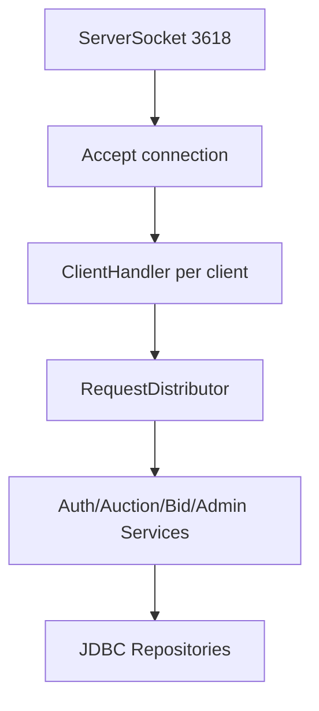
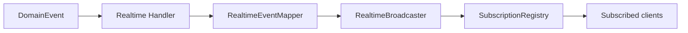

# Kiến Trúc Real-time Và Xử Lý Đồng Thời vBay

Realtime của vBay được xây trên TCP Socket persistent connection. Server nhận request theo từng `ClientHandler`, xử lý nghiệp vụ trong service layer, sau đó phát domain event thành realtime event đến các room liên quan.

## 1. TCP Server Và Client Handler

- Mỗi client có một socket connection và một `ClientHandler`.
- `ClientConnection.send(...)` đồng bộ việc ghi message ra socket.
- Client đọc message bằng listener thread, parse tại `ServerMessageParser`, sau đó đẩy event vào `RealtimeEventDispatcher`.

## 2. Room-based Subscription

Room hiện tại gồm:

| RoomType | Phạm vi |
| :--- | :--- |
| `AUCTION` | Các event của một auction cụ thể: state, bid history, watcher count |
| `USER` | Event riêng của một user: balance, my bid item, admin warning/kick, deposit result, autobid |
| `AUCTION_LIST` | Event cho danh sách auction và admin deposit lobby |

## 3. Room Key Và Subscription Registry

Subscription là quan hệ runtime giữa một `ClientConnection` và một `Room`. Khi client subscribe, server không lưu trực tiếp object room làm identity chính, mà gọi `Room.key()` để mã hóa room thành một string key ổn định. Key này là khóa tra cứu trong `InMemorySubscriptionRegistry`.

`Room.key()` hiện tạo key như sau:

| Room | Key | Ý nghĩa |
| :--- | :--- | :--- |
| `AUCTION` + `targetId = 10` | `auction:10` | Màn chi tiết auction 10 |
| `USER` + `targetId = 2` | `user:2` | Room riêng của user 2 |
| `AUCTION_LIST` không filter | `auction-list:all` | Danh sách auction mặc định |
| `AUCTION_LIST` có filter | `auction-list:{filterKey}` | Danh sách auction theo filter |

Registry lưu subscription hai chiều trong RAM:

- `subscribersByRoom`: `roomKey -> Set<ClientConnection>`, dùng khi broadcast event đến tất cả connection đang nghe room đó.
- `roomsByConnection`: `ClientConnection -> Set<roomKey>`, dùng khi socket disconnect để dọn toàn bộ subscription của connection.

Khi broadcast, `RealtimeBroadcaster` lấy `event.getRoom().key()` rồi gọi `registry.findSubscribers(event.getRoom())`. Nhờ vậy broadcaster không cần duyệt toàn bộ client và tự so điều kiện; nó chỉ gửi event đến đúng set connection đã subscribe cùng room key.

`RoomFilter` là một phần của room identity, không phải state UI tạm thời. Với `AUCTION_LIST`, filter giúp phân loại các luồng dữ liệu list, ví dụ sau này có thể có list theo `category`, `status` hoặc `seller`. `RoomFilter.keyPart()` sort filter key, encode key/value rồi ghép thành chuỗi ổn định, nên các client mở cùng một list filter sẽ subscribe vào cùng một room key.

Subscription hiện tại là in-memory. Khi client tắt app, socket disconnect hoặc server restart, subscription runtime sẽ mất. Lợi ích của room key không phải là làm subscription sống qua restart, mà là tạo định danh deterministic: sau khi reconnect và fetch snapshot mới nhất, client có thể subscribe lại đúng room bằng cùng `RoomType`, `targetId` và filter. Nếu sau này mở rộng sang Redis hoặc multi-server, room key dạng string cũng dễ dùng làm distributed channel/key hơn object identity trong JVM.

`RoomSubscriptionValidator` chọn rule theo `RoomType` trước khi registry lưu subscription:

- `USER` room yêu cầu login, có `targetId`, không nhận filter và `targetId` phải bằng `session.userId`.
- `AUCTION` room yêu cầu login, có `targetId` và không nhận filter.
- `AUCTION_LIST` không nhận `targetId`; filter là phần mở rộng để phân loại list room.

Khi connection đóng, `SubscriptionService.disconnect(...)` gọi `unsubscribeAll(connection)` để xóa connection khỏi mọi room trong `roomsByConnection` và `subscribersByRoom`.

## 4. Event Flow

- Bid thành công phát `BidUpdatedDomainEvent`, `AuctionListItemUpdatedDomainEvent`, `UserBalanceUpdatedDomainEvent`.
- Buy now phát event auction state, bid history, balance và list item.
- Auction start/end từ scheduler phát auction state và list item.
- Auto-bid update phát `AUTOBID_UPDATED` vào room `USER`.
- Admin actions phát event user/auction/deposit tương ứng.

## 5. Client Realtime Lifecycle

Phía client không render UI chỉ bằng event realtime. Mỗi màn hình luôn lấy một snapshot mới nhất trước, sau đó mới dùng realtime event để merge incremental update.

Quy trình chuẩn khi mở màn:

1. Controller fetch snapshot mới nhất từ server bằng request tương ứng, ví dụ auction list, auction detail hoặc my-bid list.
2. Controller render snapshot đó thành state hiện tại của màn hình.
3. Controller subscribe đúng server room và đúng event type mà màn đó cần.
4. Khi nhận realtime event, controller merge event lên snapshot/cache hiện tại bằng `auctionVersion`, `version` hoặc `updatedAt`.
5. Khi dispose màn, controller unsubscribe listener, unsubscribe room nếu có, stop timer/timeline và bỏ state riêng của màn.

`RealtimeEventDispatcher` ở client chỉ điều phối event theo `RealtimeEventType`. Dispatcher không quyết định event nào còn mới; controller giữ cache của màn và tự bỏ stale event.

Các rule xử lý stale chính:

- Với auction list item, nếu incoming `auctionVersion` nhỏ hơn version đang có thì bỏ qua.
- Nếu version bằng nhau, dùng `updatedAt` để tránh event cũ ghi đè snapshot hoặc event mới hơn.
- Với auction detail, `AUCTION_STATE_UPDATED` chỉ apply khi `payload.auctionVersion > currentAuction.version`.
- Với my-bid/autobid state, controller cũng dùng `auctionVersion` và `updatedAt` để tránh private state cũ ghi đè state mới.
- Mọi callback chạy sau khi màn đã rời phải check `disposed` trước khi đụng vào UI.

Cách này giúp client chịu được event đến muộn, event lặp, hoặc response snapshot về sau event realtime. Snapshot vẫn là nguồn khởi tạo state, realtime chỉ là lớp cập nhật liên tục.

## 6. Auction Scheduler

`AuctionTaskScheduler` quản lý start/end task bằng `ScheduledExecutorService`.

- Khi server start, scheduler đọc auction cần lập lịch từ database.
- Khi auction đến giờ start/end, scheduler gọi `AuctionService.syncAuctionStatus`.
- Recovery task định kỳ quét auction bị missed do server restart/crash.
- `AuctionScheduleDomainEventHandler` nằm cạnh scheduler và lắng nghe `AuctionListItemUpdatedDomainEvent`.
- Handler chỉ refresh lịch với các reason có thể ảnh hưởng scheduling: `CREATED`, `STATUS_CHANGED`, `TIME_CHANGED`.
- Anti-snipe có thể cập nhật `ending_time`; bid flow chỉ cần phát list item event với reason `TIME_CHANGED`, scheduler sẽ tự reschedule end task.
- Nếu sau này seller được phép đổi thời gian auction, service đó cũng chỉ cần phát `TIME_CHANGED`; không cần phụ thuộc trực tiếp vào scheduler.
- Cách event-driven này giữ scheduler ít coupling với nghiệp vụ bid/seller/admin và dễ mở rộng khi có thêm nguồn làm thay đổi thời gian auction.

## 7. Concurrency Safety

- Service layer thiết kế gần stateless; mỗi request tạo connection/transaction riêng.
- Flow bid/buy now/auto-bid lock auction bằng `FOR UPDATE`.
- SQL update balance có điều kiện `available_balance >= ?` hoặc `hold_balance >= ?`.
- Collection realtime/subscription dùng các cấu trúc thread-safe.
- Event chỉ publish sau khi transaction commit để client không nhận state chưa commit.

Phần trên xử lý race condition ở server. Với realtime event, hệ thống còn phải xử lý stale update ở client vì event có thể đến muộn, đến lặp hoặc response snapshot có thể về sau event mới hơn. Cách xử lý là mỗi payload quan trọng mang theo `auctionVersion`, `version` hoặc `updatedAt`; controller chỉ merge event nếu event mới hơn state đang giữ.

Các rule stale chính:

- Snapshot từ request là nguồn khởi tạo state của màn hình; realtime chỉ merge incremental update lên snapshot đó.
- Nếu incoming `auctionVersion` nhỏ hơn version hiện tại thì bỏ qua.
- Nếu version bằng nhau, so thêm `updatedAt` để tránh event cũ ghi đè state mới.
- Với auction detail, `AUCTION_STATE_UPDATED` chỉ apply khi `payload.auctionVersion > currentAuction.version`.
- Với auction list, my-bid và autobid state, controller cũng dùng `auctionVersion`/`updatedAt` để bỏ event cũ.
- Khi màn hình dispose, callback realtime phải check state `disposed` trước khi cập nhật UI; listener, room subscription và timer của màn phải được hủy.

## 8. Liên Kết Với Bidding Pipeline

Realtime không trực tiếp quyết định logic bid/auto-bid. Các service bidding xử lý transaction, tạo result nghiệp vụ và publish domain event sau khi commit.

- Manual bid, auto-bid và buy now phát các domain event tương ứng để realtime mapper tạo payload public/private.
- Public room `AUCTION` và `AUCTION_LIST` chỉ nhận state công khai như current price, winner, bid history, reserve met và auction version.
- Dữ liệu riêng của user như balance, my-bid item và `maxBidAmount` chỉ gửi qua room `USER`.
- Khi bid flow tạo anti-snipe extension, event `AUCTION_LIST_ITEM_UPDATED` với reason `TIME_CHANGED` vừa cập nhật UI vừa kích hoạt scheduler reschedule.
- Chi tiết về `AuctionBidEngine`, `BidResolution`, `BidResolutionApplier` và `AuctionChange` được tách sang `bidding-architecture.md`.
